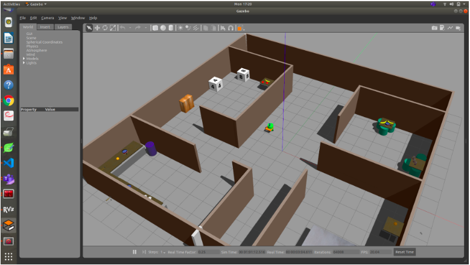
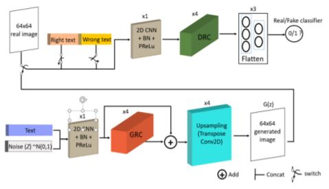
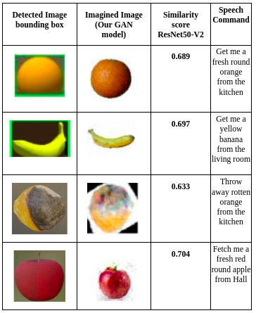

# ROBOT CAN IMAGINE : Object detection for service robot using Generative Adverserial Newtorks 

Demonstration of RCI, an imaginative approach object detection, for service-robots, to generate images based on users speech to fetch items.

## Demonstration

### `Environment with fruits and objects placed in "living room", "bed-room","kitchen" and "Drawing-room`

* User commands robot to get "Banana from living room".

* robot understands banana fruit word through NLP and generates an image representation of banana through text to image GANs using attention mechanism.

### `Workflow with example of robot fetching orange fruit from kitchen`

### `Proposed Generator & Discriminator Residual blocks with attention module`

### `Proposed IL-GAN architecture`

### `Detecting banana based on user's speech .... "Get me a banana from living-room"!`

##### 1. Convert speech to text using using Deep NLP model
##### 2. Using proposed GANs method, convert text to image (Imaingation/image representation of words)
##### 3. NLP to understand location, and fetch object, since robot has the map of the environment (SLAM).
##### 4. Detect object based on imagined image with real object in environemnt using (DIS) Deep Image Similarity.

## Result

We've developed a pipeline for making an assistive robot comprehend and fetch objects based on their visual representation. The suggested IL-GANs created images based on the user's spoken command and then travelled to the intended location, where the generated images were compared to items at the site. The produced objects are akin to "imagination of things," in which the object learns attributes from a dataset and uses those features to build pictures based on the description. We did this by calculating similarity scores for picture comparison utilising the attention mechanism and residual networks in the TI-GAN architecture. For future works, this method can be used as online-incremental learning and deep reinforcement learning to learn with fewer data initially to get image representation (GANs) and continuously learn about objects to fetch from its interaction with the environment.
